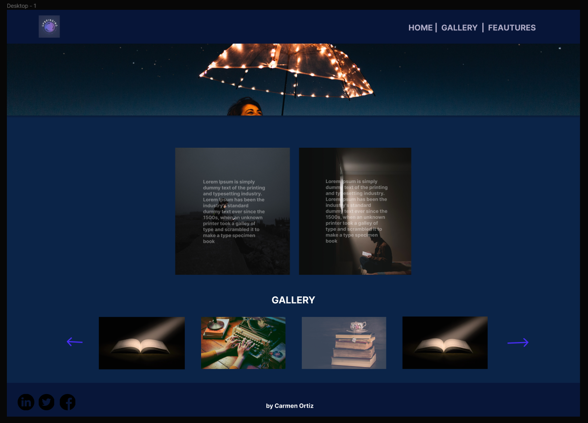
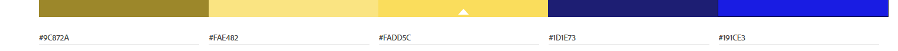

# PROYECTO_INDIVIDUAL_DIW_22-23_CarmenOrtiz

### Introducción

En este proyecto me he querido inspirar en la Gran Manzana, Nueva York.
Una de las ciudades que más me gustan y más interesantes del mundo en mi opinión.
Y en está ocasión, me ha inspirado la noche de Nueva York.

### Diseño

- Mockup
  
  Esta maquetación de la página me ha ayudado a seguir un procedimiento en mi maquetación, desde un principio, aunque en un momento dado
  he modificado alguna pequeña cosa.
- Colores
  
  Está fue la gama de colores que elegí, porque consideré hacerla en colores oscuros con algunos elementos en colores más llamativos como son los amarillos.
  He jugado mucho con la opacidad de los colores, ya que tampoco me terminaba mucho mezclar muchos colores.
- Tipografías
  _ Abril fatface
  _ Lato
  Creo que se complementan, la primera de ellas es con serifa y la segunda sin serifa.

### Proceso

En primer lugar he maquetado la página de manera estructural, y poniendo las clases inspirandome en la metodología BEM, para luego hacer uso de ellas en SASS.
Debo decir que es la primera vez que trabajo con SASS y ha sido una gozada, facilitandome la escritura del CSS.
Después de tener la maquetación y el responsive hecho, ya he comenzado ha Introducir los estilos e imagenes que quería utilizar en la Web, para, por último darle
comprobar el responsive y solucionar los problemas que iban surgiendo en las diferentes secciones.
Respecto al carrusel de la galería, es sencillo pero he querido hacerlo con html y sass exclusivamente, sin usar boostrap, ya que me apetecía aprender a hacer uno por mi misma. Además, le he dado su funcionalidad usando JavaScript.
Por otro lado tengo un slider a mitad, para darle un poco de dinamismo a la Web.
Otro elemento introducido en la Web, ha sido el botón que va hacia arriba, y su funcionalidad también la he hecho con JavaScript.
Por último, destacar que para trabajar con SASS he creado dos archivos sccs, uno "libreria.scss" que contiene los mixins y variables, y algun que otro array, para que en el archivo "styles.scss", quedará más limpio.

### Recursos

- [Para las imagenes](https://www.pexels.com/search/mask/)
- [Para iconos](https://icons.getbootstrap.com/)
- [Para retocar imagenes](https://www.befunky.com/es/opciones/editor-de-fotos/)

### Inspiración

- [Sobre Nueva York](https://www.nuevayork.net/)
- [Más de Nueva York](https://es.nycgo.com/?cid=brandusa_website_nycpage_exploremore_20170511)
